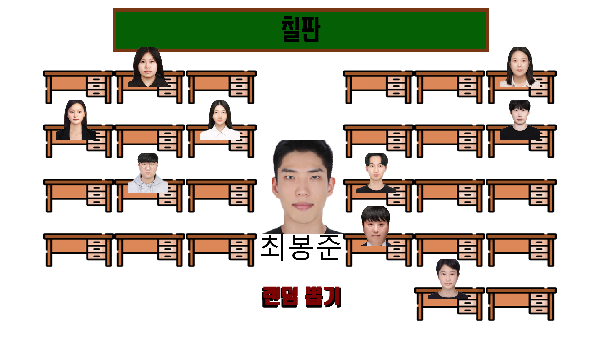

# 대전 2반 자리 뽑기 프로그램

## 목표 
- 알고리즘 공부를 하기 위한 단일 프로젝트
- 실생활에 적용할 수 있는 방법으로 친숙하게 알고리즘 학습하기
- 반 학우들을 위한 엔터테이너적인 요소를 추가한 자리 뽑기 프로그램

## 실제 게임 이미지

## 주요 알고리즘

1. 자리 배치 알고리즘 (draw_place 및 stop_place 함수)
    - 학생들을 랜덤한 자리로 배치하는 알고리즘으로, 이미 선택된 자리에 다른 학생이 배치되지 않도록 처리합니다. 이를 통해 효율적이고 중복 없는 자리 배치를 구현합니다.
2. 버튼 클릭 감지 및 동작 처리 알고리즘 (Button 클래스)
    - 화면에 표시된 버튼에 마우스 클릭 이벤트를 감지하고 해당 동작을 실행합니다. 마우스 위치와 클릭 여부를 확인하여 알맞은 이미지를 출력하며, 클릭 시 지정된 동작을 실행하는 구조로 구성되어 있습니다.
3. 게임 종료 및 최종 자리 출력 알고리즘 (game_over 함수)
    - 모든 학생의 배치가 완료되면 최종 자리 배치 결과를 output.txt 파일에 저장하는 알고리즘입니다. 이를 통해 자리 배치 결과를 기록하고 관리할 수 있습니다.